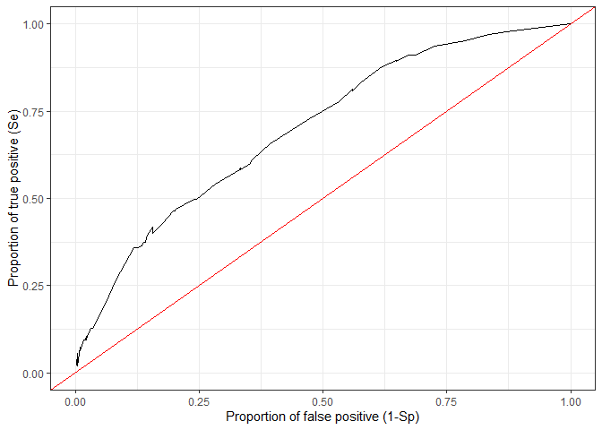
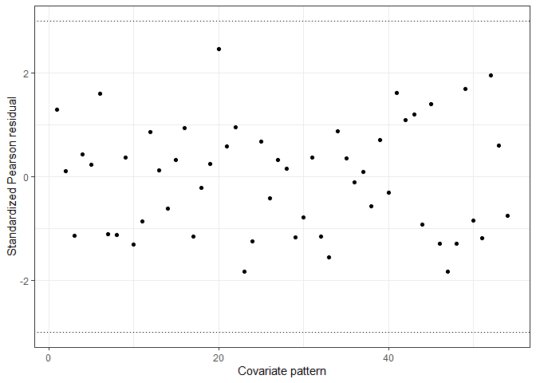
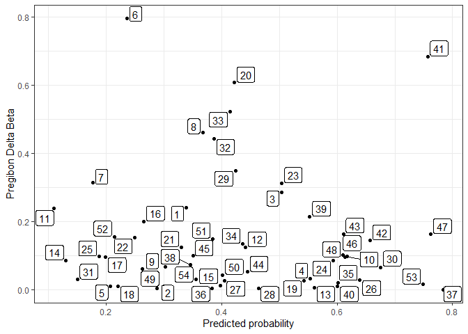

モデルの評価
================
Arata Hidano
4/25/2021

## Import data データを取り込み

``` r
# Set directory
setwd("D://tem")
BH_dat = read.csv("BH_dat_adjusted.csv",header=T)
library(epiR); library(ResourceSelection); library(rms); library(ggplot2); library(pROC); library(ggrepel)

# Check data データが存在するか確認
head(BH_dat)
```

    ##   animalid status exotic   sexp      cage   fsummer2 .fgspr dzkid
    ## 1        1      1 Exotic Female 3-5 years Fresh fern      1    18
    ## 2        2      0 Exotic Female 3-5 years Fresh fern      3    18
    ## 3        3      0 Exotic   Male 3-5 years Fresh fern      2    18
    ## 4        4      0 Exotic   Male 3-5 years Fresh fern      3    18
    ## 5        5      0  Local   Male 3-5 years Fresh fern      3    18
    ## 6        6      1 Exotic Female   6 years Fresh fern      2    18

``` r
# 変数の型の調整
BH_dat$fsummer2 = factor(BH_dat$fsummer2,levels=c("No fern","Dry fern","Fresh fern","Not housed"))
BH_dat$cage = factor(BH_dat$cage)　
                # cageはcharacter(文字列型)なのでモデル内ではfactor(因子型)と同じように扱われる。しかし今回以下で使用する関数はfactorに変換しないとエラーが出るものがあるため、明示的にcharacterをfactorに変換しておく。
BH_dat$.fgspr = factor(BH_dat$.fgspr)
# 目的変数および最終モデルに残った説明変数に欠損値のあるデータを除いておく
BH_dat = BH_dat[!is.na(BH_dat$status),]
BH_dat = BH_dat[!is.na(BH_dat$cage) & !is.na(BH_dat$.fgspr) & !is.na(BH_dat$fsummer2),]

# Final model
multi_model_full_BF2_1 = glm(status~cage + factor(.fgspr) + fsummer2
                              ,data=BH_dat,family="binomial")
```

## Model evaluation 1: overall goodness of fit using residual

``` r
BH_mf1 = model.frame(multi_model_full_BF2_1)

# Extract unique covariate pattern 説明変数の組み合わせパターンを抜き出す
BH_cp1 = epi.cp(BH_mf1[-1]) ## [-1]とするのはここでは目的変数には興味がないため、一つ目の変数であるstatusを除去している
BH_cp1 
```

    ## $cov.pattern
    ##     id  n      cage factor..fgspr.   fsummer2
    ## 1    1  3 3-5 years              1 Fresh fern
    ## 2    2 34 3-5 years              3 Fresh fern
    ## 3    3  4 3-5 years              2 Fresh fern
    ## 6    4  3   6 years              2 Fresh fern
    ## 7    5 13   6 years              3    No fern
    ## 8    6 26 7-8 years              3    No fern
    ## 9    7 28 3-5 years              3    No fern
    ## 10   8 28 7-8 years              3 Fresh fern
    ## 13   9 47 3-5 years              3 Not housed
    ## 14  10  1   9+years              1 Not housed
    ## 15  11 51 3-5 years              0    No fern
    ## 18  12  3 7-8 years              1 Not housed
    ## 21  13 21   9+years              3 Not housed
    ## 22  14 22   6 years              0    No fern
    ## 24  15  2   6 years              2    No fern
    ## 26  16 17   9+years              0    No fern
    ## 27  17  5 3-5 years              0 Not housed
    ## 29  18 15   6 years              0 Fresh fern
    ## 30  19 34   9+years              3 Fresh fern
    ## 35  20  4   9+years              0 Not housed
    ## 40  21 24   6 years              3 Fresh fern
    ## 61  22 11 7-8 years              0 Fresh fern
    ## 63  23  3 7-8 years              0   Dry fern
    ## 64  24  1 7-8 years              2 Fresh fern
    ## 65  25 21 3-5 years              0 Fresh fern
    ## 67  26  7 7-8 years              3   Dry fern
    ## 74  27 16   9+years              0 Fresh fern
    ## 78  28  4   6 years              0   Dry fern
    ## 81  29  5 7-8 years              1 Fresh fern
    ## 83  30  4   9+years              0   Dry fern
    ## 84  31 23 7-8 years              0    No fern
    ## 111 32 21   9+years              3    No fern
    ## 121 33 10 3-5 years              0   Dry fern
    ## 149 34  3 7-8 years              2    No fern
    ## 154 35  6   6 years              3   Dry fern
    ## 155 36 24 7-8 years              3 Not housed
    ## 157 37  5   9+years              3   Dry fern
    ## 167 38 11   6 years              3 Not housed
    ## 176 39 23 3-5 years              3   Dry fern
    ## 221 40  2   9+years              1 Fresh fern
    ## 233 41  6 3-5 years              2   Dry fern
    ## 236 42  2   6 years              1   Dry fern
    ## 239 43  2 3-5 years              1   Dry fern
    ## 260 44  1   9+years              1    No fern
    ## 298 45  1 3-5 years              2    No fern
    ## 301 46  1   9+years              2    No fern
    ## 302 47  1   9+years              2 Not housed
    ## 306 48  1 7-8 years              2 Not housed
    ## 348 49  1 7-8 years              0 Not housed
    ## 372 50  1   6 years              1 Not housed
    ## 469 51  2   6 years              1 Fresh fern
    ## 470 52  1 3-5 years              1    No fern
    ## 492 53  1   9+years              2 Fresh fern
    ## 520 54  1 3-5 years              1 Not housed
    ## 
    ## $id
    ##   [1]  1  2  3  2  2  4  5  6  7  8  7  2  9 10 11 11 11 12  7  5 13 14  7 15  2
    ##  [26] 16 17  7 18 19  8 11  6 11 20 14  8  2 19 21 19 19 21  2  8 19  2  2 21 21
    ##  [51]  8  2 21  2 21  2  8 21  8 21 22  8 23 24 25 19 26  6 26 19 25 19 19 27  8
    ##  [76] 19 27 28 27 19 29 25 30 31 21  8 18 25 27 14 19  2 22 18 16 11  8  8  2 25
    ## [101] 21 21  8  2  5 25 16 22  6  5 32 31 14 21  4 11 18  2  7  3 33  5 19 18 25
    ## [126]  2 25 22 33 33 19 32  6 16  7 32  6 11  2 32  7 27 27 27 32  6 32 19 34 32
    ## [151] 32 13 32 35 36 26 37 13 13 14 34 32 32  5  6  5 38  6 32  6 26 36 21  7  9
    ## [176] 39  2  9  2 26  9 38  8 36  8 13  9  9 36 38 21 36 13 13 13  2  2 38  6  7
    ## [201]  2  9  8  7 36  8 39 13 31 32 32 19 27 31 18 11 31 16  9 29 40 21 21  2 21
    ## [226]  2  2  2 21 19 25 11 41 14 14 42 25 14 43 18 41 22 11 31 41 11 39 11 39 31
    ## [251] 31 11 39 14 35 31 31 39 14 44 27 27 13 13  2 39  7 32 31 32 16 16 14 31 16
    ## [276] 31 31 16  8 21  8  8 19 27 39 22 21  8 19 19  9  9 38 17  9  9 45  6 15 46
    ## [301] 47 34 29 28 48 13 27 27 30 30 38 20 36 36  9 36 38 20 13 18 36 13 23 33 17
    ## [326] 20 39 14 11 19 39 36  9 36  9 32  7  6 32 32  5 13 13 13 17  9 49  2 36 13
    ## [351] 37 36 29  1  9 18 36  9 22 25 13 33 27 23 27 18 22 16 11 50 38 17  9 36  9
    ## [376]  9  9  9  9 38 36  9 38 36  9  9  9  9 25 19 22  9 36  9  9 12  9  9 38  9
    ## [401]  6  5  6  6 16 31  6  7  6  7  7  6  5  6  6  7  6  6 39  7  9  2 35 39  3
    ## [426] 21 11 11 14 33 18 14 16 11 36 25 39 39 25 39  4 25 25 33 39 11 11 11 36  9
    ## [451] 36  9  9  9  9  7  9 28 11 25  8 35  2 37  2 21 51 52 18 19  8 51 22 18 11
    ## [476] 25 29 22 25 27  1 33 33 14 11 11 11 18 11 53 21 19  8 25  2  3 18 19  8 40
    ## [501] 19  2  8 19 19 19 19 19  8 19  8 21 19 19 13 13 14 54 25 12 36  9  9  9  7
    ## [526]  9  9 36 32 33 26 26 41 42 43 41 41 39 39 39 35 39 30 39 39 37 39 35 28 37
    ## [551] 31  6  6 14 16 11 11  5 32  7  6  7  7 14 16 31 11 11 31  5  7 11  7  7  7
    ## [576]  7  5 11 11 31 31 14 16 11 11 16 11 31 11 11 14 16 31 11 11 31 14 11 11 11
    ## [601] 11 11 11 11 14 11 11

``` r
    ### 独自の説明変数のパターンにidが与えられ、各行（データポイント）がどの変数パターンに属しているか変数パターンのidが表示される

# Prediction of outcome values based on explanatory variables 各変数パターンについて目的変数を最終モデルを使って予測する

predicted_cp1 = data.frame(BH_dat , cpid = BH_cp1$id, fit = fitted(multi_model_full_BF2_1))

head(predicted_cp1)
```

    ##   animalid status exotic   sexp      cage   fsummer2 .fgspr dzkid cpid
    ## 1        1      1 Exotic Female 3-5 years Fresh fern      1    18    1
    ## 2        2      0 Exotic Female 3-5 years Fresh fern      3    18    2
    ## 3        3      0 Exotic   Male 3-5 years Fresh fern      2    18    3
    ## 4        4      0 Exotic   Male 3-5 years Fresh fern      3    18    2
    ## 5        5      0  Local   Male 3-5 years Fresh fern      3    18    2
    ## 6        6      1 Exotic Female   6 years Fresh fern      2    18    4
    ##         fit
    ## 1 0.3387538
    ## 2 0.2875058
    ## 3 0.5039057
    ## 4 0.2875058
    ## 5 0.2875058
    ## 6 0.5537028

``` r
      # cpidは変数パターンを示したid、fitは最終モデルを利用した目的変数の推定値(1を取る確率)　同じcpidを持つデータポイントは同じfitを持つことに着目しよう

# Pearson chi-squared test based on covariate pattern　説明変数のパターンを用いたピアソンテスト

  # まずそれぞれの説明変数パターンがどれだけ目的変数1を取ったか集計する（観測値の集計）
BH_obs01 = as.vector(by(predicted_cp1$status, as.factor(predicted_cp1$cpid), FUN =
sum))

        sum(BH_obs01)　#　確認:合計で203のデータが目的変数1を取っている
```

    ## [1] 203

``` r
  # 次に各変数パターンがとった目的変数の予測値を摘出
BH_fit01 = as.vector(by(predicted_cp1$fit , as.factor(predicted_cp1$cpid), FUN = min))

  # epi.cpresidsを使って各種残差(residual)を計算
BH_res01  = epi.cpresids(obs = BH_obs01, fit = BH_fit01, covpattern = BH_cp1)

  # 自由度を計算
df = max(BH_cp1$id) - (length(multi_model_full_BF2_1$coefficients) - 1) - 1

  # ピアソン残差を用いた評価
        pearson = sum(BH_res01$pearson^2)
        pearson
```

    ## [1] 51.3588

``` r
        1 - pchisq(pearson,df)
```

    ## [1] 0.2076079

``` r
            # 0.2076079
  # 逸脱残差を用いた評価
        deviance = sum(BH_res01$deviance^2)
        1 - pchisq(deviance,df)
```

    ## [1] 0.0515333

``` r
            # 0.0515333

  # Hosmer-Lemeshow test
  # hoslem.test function (in ResourceSelection package)で実行可能
  # 様々な理由からHosmer-Lemeshow testは最近推奨されない。以下のThe le Cessie-van Houwelingen normal testを参照
        hoslem.test(x = predicted_cp1$status, y = predicted_cp1$fit, g = 10)
```

    ## 
    ##  Hosmer and Lemeshow goodness of fit (GOF) test
    ## 
    ## data:  predicted_cp1$status, predicted_cp1$fit
    ## X-squared = 4.8251, df = 8, p-value = 0.7761

``` r
          # x = observed values, y = expected value, g = number of groups
          # p-value = 0.7761
      
        
  # The le Cessie-van Houwelingen normal test
  # residuals function (in rms package)
        lrm01 = lrm(status~cage + .fgspr + fsummer2,data=BH_dat, x = TRUE, y = TRUE)
              # residuals で使うためにlrmを使ってモデルを書き直す                      
        lrm01.res01 = residuals(lrm01, type = "gof")
        lrm01.res01
```

    ## Sum of squared errors     Expected value|H0                    SD 
    ##           119.6914525           119.3297876             0.3351543 
    ##                     Z                     P 
    ##             1.0790998             0.2805432

``` r
           # p =0.2805432
```

## Model evaluation 2: Model predictivity using ROC Curve

``` r
# Extract predicted value
predicted_value = sort(unique(predicted_cp1$fit))

# For each cut-off point, calculate sensitivity (how many true positives are considered positive) and specificity (how many true negatives are considered negative)
Se = Sp = c()
for(i in 1:length(predicted_value))
{
  tmp_value = predicted_cp1$fit - predicted_value[i]
  tmp_status = ifelse(tmp_value>=0,1,0)
  Se = c(Se,sum(ifelse(predicted_cp1$status==1 & tmp_status == predicted_cp1$status,1,0))/sum(predicted_cp1$status))
  Sp = c(Sp,sum(ifelse(predicted_cp1$status==0 & tmp_status == predicted_cp1$status,1,0))/(nrow(predicted_cp1)-sum(predicted_cp1$status)))
}
ROC_curve.dta = cbind.data.frame(y=Se,x=(1-Sp))
ggplot(data=ROC_curve.dta,aes(x=x,y=y))+geom_line()+labs(x="Proportion of false positive (1-Sp)",y="Proportion of true positive (Se)")+geom_abline(intercept=0,slope=1,color="red")+
  scale_x_continuous(limits=c(0,1))+ scale_y_continuous(limits=c(0,1))+
  theme_bw()
```

<!-- -->

``` r
# Calculate AUC
auc(predicted_cp1$status,predicted_cp1$fit) #0.6988
```

    ## Setting levels: control = 0, case = 1

    ## Setting direction: controls < cases

    ## Area under the curve: 0.6988

## Model evaluation 3: Local goodness of fit. Identifying outliers using Pearson residual

``` r
# BH_res01には既に標準化されたピアソン残差が含まれている
BH_res01$spearson
```

    ##  [1]  1.29670861  0.10521984 -1.14775729  0.43296926  0.22936060  1.60218283
    ##  [7] -1.11387935 -1.12129866  0.36104175 -1.30912661 -0.85936770  0.86119669
    ## [13]  0.12740239 -0.62266149  0.31626380  0.93476418 -1.15589889 -0.21239075
    ## [19]  0.25205742  2.46865310  0.58558257  0.96133834 -1.83321523 -1.24286124
    ## [25]  0.66910798 -0.41138885  0.31486132  0.15677032 -1.17331541 -0.79068427
    ## [31]  0.36607328 -1.15873987 -1.55386403  0.88303103  0.35671359 -0.10960405
    ## [37]  0.09077959 -0.57880346  0.71180122 -0.30787610  1.61696164  1.09011128
    ## [43]  1.19970238 -0.92304671  1.39744964 -1.29714968 -1.83535917 -1.29215647
    ## [49]  1.69326645 -0.84583271 -1.18316328  1.95715525  0.59181753 -0.76161180

``` r
    # Not run: Below manipulating data to make covariate pattern 20 to have a large standardized Pearson residual
    # BH_res02 = BH_res01
    # BH_res02[which(BH_res02$cpid==20),]$spearson = 4.6
    # ggplot(data=BH_res02,aes(x=cpid,y=spearson)) + geom_point()+ geom_hline(yintercept=-3,linetype="dotted") + geom_hline(yintercept=3,linetype="dotted") +
    #   geom_point(data=BH_res02[BH_res02$cpid==20,],
    #              pch=21, fill=NA, size=4, colour="red", stroke=1) +
    #   labs(x="Covariate pattern", y="Standardized Pearson residual") + theme_bw()

# Plot standardized Pearson residuals across covariate patterns
ggplot(data=BH_res01,aes(x=cpid,y=spearson)) + geom_point()+ geom_hline(yintercept=-3,linetype="dotted") + geom_hline(yintercept=3,linetype="dotted") +
  labs(x="Covariate pattern", y="Standardized Pearson residual") + theme_bw()
```

<!-- -->

## Model evaluation 4: Local goodness of fit. Identifying important observations using delta-betas

``` r
# Represent the effect of each covariate pattern or observation on coefficients of variables included in the model
BH_res01$predicted = BH_fit01
ggplot(BH_res01,aes(x=predicted,y=deltabeta)) + geom_point() + labs(x="Predicted probability", y ="Pregibon Delta Beta") +
  geom_label_repel(aes(label=cpid),box.padding   = 0.1, point.padding = 0.1) +theme_bw()
```

<!-- -->

``` r
# Check what the pattern 6 and 41 are;
predicted_cp1[predicted_cp1$cpid==6,][1,] # 7-8 years, No fern, .fgspr = 3
```

    ##   animalid status exotic   sexp      cage fsummer2 .fgspr dzkid cpid       fit
    ## 8        8      1  Local Female 7-8 years  No fern      3    13    6 0.2354315

``` r
nrow(predicted_cp1[predicted_cp1$cpid==6,]) # 26
```

    ## [1] 26

``` r
predicted_cp1[predicted_cp1$cpid==41,][1,] # 3-5 years, Dry fern, .fgspr = 2
```

    ##     animalid status exotic sexp      cage fsummer2 .fgspr dzkid cpid       fit
    ## 233      233      1  Local Male 3-5 years Dry fern      2    12   41 0.7566584

``` r
nrow(predicted_cp1[predicted_cp1$cpid==41,]) # 6
```

    ## [1] 6
